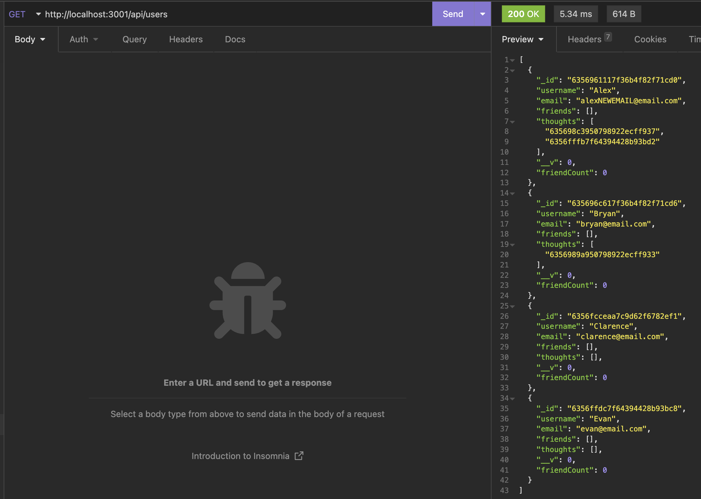
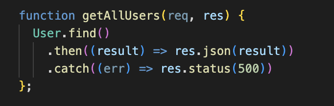

# Social Network

## Table of Content
* [Description](#description)
* [Instructions](#instructions)
* [Visuals](#visuals)
* [Walkthrough](#walkthrough)

## Description
This project was made to create a social network allowing users to add friends, create thoughts, and reactions to thoughts. Using insomnia you can add, delete, and update all of the information made available.

## Instructions
In the CLI, run "npm i" to install all the dependencies, then run "npm run start" to start the server.

## Visuals

Insomnia Request

Code that got prior insomnia request to work 

## Walkthrough
[Video of walkthrough](https://drive.google.com/file/d/1FtrsZSncLFqT7XLLOdto7OqAEczMxf0w/view?usp=sharing)